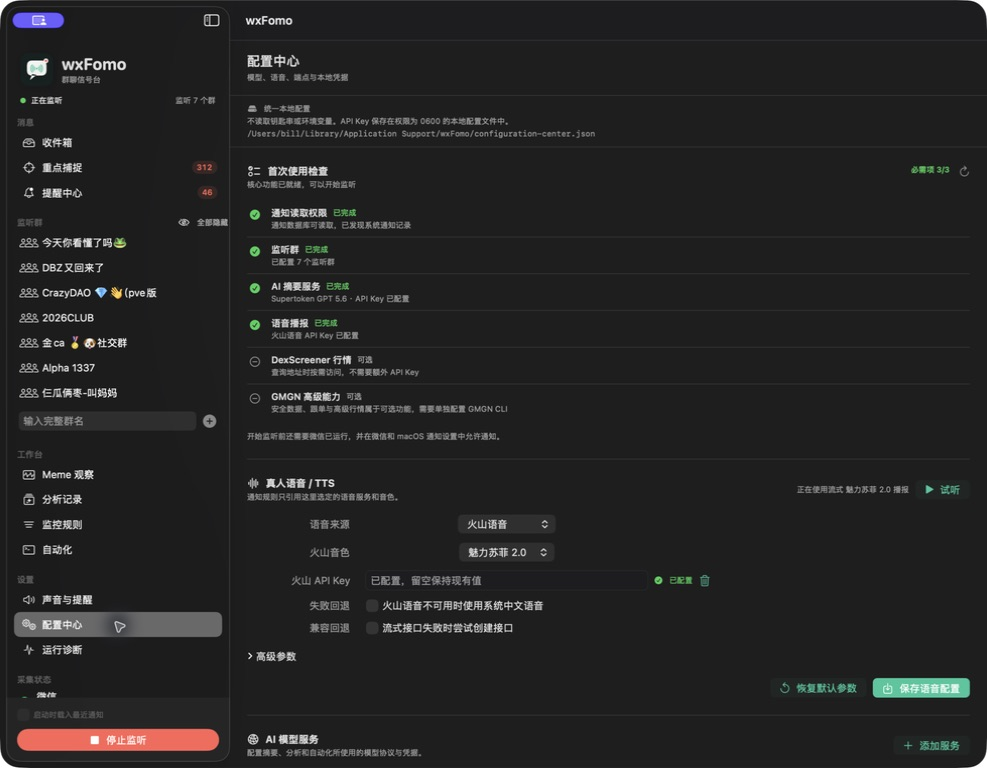
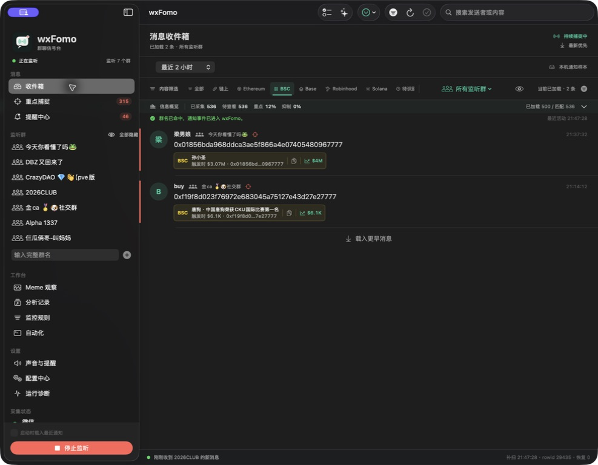
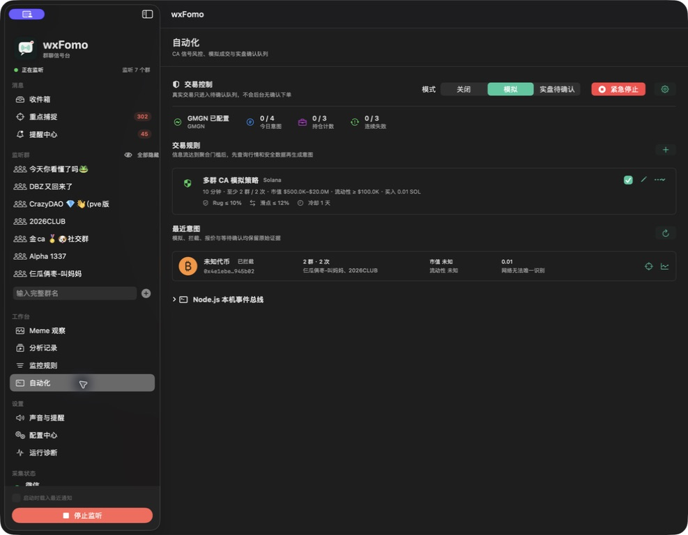

# wxFomo

macOS 微信群只读信息流监听器，提供原生图形界面和 CLI。默认模式监听 macOS Notification Center 数据库的文件变化，以全局 `rowid` 增量扫描来源标识，只解码官方微信的新通知，再按群白名单显示消息或输出 NDJSON。

这不是微信官方 API，也不是完整微信消息流。它只能取得系统实际投递的微信通知。

## 路线与边界

默认 `listen`：

- 由 Notification Center 数据库写入事件触发，不做截图轮询
- 增量扫描通知来源标识，但只读取和解码官方微信的 payload
- 不要求微信群窗口保持打开
- 不发送或回复消息
- 不模拟鼠标或键盘
- 不注入微信进程
- 不解密微信数据库
- 不读取或保存微信登录凭证
- 不抓取微信网络协议

通知来源严格匹配官方微信标识 `com.tencent.xinWeChat`，同时兼容 macOS 通知数据库使用 Team ID 前缀的 `5A4RE8SF68.com.tencent.xinWeChat` 形式。

它会只读访问 macOS 的 Notification Center 数据库，因此需要“完全磁盘访问”权限。该权限本身范围较大，wxFomo 在代码中仍只打开下面这个文件：

```text
~/Library/Group Containers/group.com.apple.usernoted/db2/db
```

可选 `ocr-listen` 使用 ScreenCaptureKit + 本机 Vision OCR 补漏，需要屏幕录制权限；它不是默认监听方式。

以上限制不代表腾讯官方授权。微信服务协议禁止未经授权的第三方工具自动访问、读取或控制微信及其数据，重要账号不应假设封号风险为零。

## 能获取什么

正常情况下，微信群通知会包含群名、发送者显示名和正文预览：

```json
{
  "content": "明天十点开会",
  "eventID": "db4a2079c9a5b963",
  "group": "项目群",
  "isFromSelf": false,
  "messageType": "text",
  "observedAt": "2026-08-30T13:45:00Z",
  "senderConfidence": "notification_payload",
  "senderDisplayName": "张三",
  "senderStableID": null
}
```

`senderDisplayName` 只是通知中显示的群昵称，不是稳定 `wxid`，可能重复或被修改。

## 已知缺口

- 群被设为免打扰时，通常不会产生系统通知。
- 微信处于前台时，部分版本可能抑制系统通知。
- macOS 专注模式、微信通知设置或隐藏预览会导致消息缺失或正文不完整。
- 图片、语音、引用、合并转发等只能取得通知预览文本。
- 如果系统通知 payload 同时携带本地附件文件，图形界面会显示图片缩略图并允许打开；微信只提供 `[图片]` 等占位时，无法取得原图。
- 系统通知不包含可靠的群友头像；界面只能用发送者昵称首字母作为本地占位，不能将其视为微信头像。
- Notification Center 清理或数据库结构升级后需要重新适配。
- 这是系统通知信息流，不保证覆盖微信群里的每一条原始消息。

如果要求完整消息、稳定成员 ID 和绝对不漏消息，只能进入微信私有数据库解密或进程 Hook；本项目明确不实现这两类高风险能力。

## 环境

- macOS 14 或更高版本
- 官方 Mac 微信客户端；当前开发机验证版本为 4.1.12
- Swift 5.10 或更高版本

## 给 Codex / AI 编码代理的开发启动说明

本项目是标准 Swift Package Manager 项目。代理应先进入包含 `Package.swift` 的目录；不要在用户主目录直接运行 Swift 命令。源码、构建和运行边界如下：

| 路径或产品 | 用途 |
|---|---|
| `Sources/WxFomoCore` | 通知解码、群名匹配、消息库、地址识别和行情解析 |
| `Sources/WxFomoApp` | SwiftUI 图形界面和 `AppModel` |
| `Sources/WxFomoCLI` | `wxfomo` 命令行工具 |
| `Sources/WxFomoSelfTest` | 无 XCTest 依赖的核心自检 |
| `scripts/build-app.sh` | 构建并 ad-hoc 签名 `dist/wxFomo.app` |

### 先确认环境

```bash
cd /path/to/wxFomo
test -f Package.swift
swift --version
sw_vers -productVersion
```

`Package.swift` 声明了 macOS 14 和 Swift 5.10；如果版本不满足，先报告环境问题，不要修改源码绕过平台限制。

### 构建、测试和启动 GUI

```bash
# Debug 编译，先确认代码能编译
swift build

# 核心回归自检
swift run wxfomo-selftest

# Release GUI App
./scripts/build-app.sh
open dist/wxFomo.app
```

GUI 产品名是 `wxfomo-gui`，CLI 产品名是 `wxfomo`，不要把两者混用。需要发布团队内测包时，在 App 构建成功后执行：

```bash
ditto -c -k --sequesterRsrc --keepParent \
  dist/wxFomo.app dist/wxFomo-0.1.0-macos-arm64.zip
codesign --verify --deep --strict dist/wxFomo.app
```

该包是 Apple Silicon arm64、未公证的 ad-hoc 签名包，不是 Intel 或通用包。

### CLI 诊断和监听

```bash
swift build -c release --product wxfomo
.build/release/wxfomo doctor
.build/release/wxfomo notification-probe --limit 10
.build/release/wxfomo listen --group "项目群"
```

CLI 的 `doctor` 只检查当前运行它的终端进程权限；GUI App 需要在“系统设置 → 隐私与安全性 → 完全磁盘访问”中单独授权，并在授权后完全退出再重新打开 App。macOS 不允许程序自动授予这项权限。

### GUI 首次启动顺序

1. 运行 `./scripts/build-app.sh` 并打开 `dist/wxFomo.app`。
2. 在 App 的“配置中心”查看“首次使用检查”：通知读取和监听群是开始监听的基础配置，AI Provider/API Key 只在使用 AI 摘要时需要。
3. 给 `wxFomo.app` 授予“完全磁盘访问”，完全退出并重新打开 App。
4. 确认微信已登录、正在运行且允许通知，在左侧添加完整群名。
5. 点击“开始监听”，用测试消息确认“收件箱”收到事件。

AI 与 TTS API Key 只能通过 App“配置中心”明确保存到本机 `configuration-center.json`；应用不会读取私钥、钥匙串、环境变量或其它隐式密钥来源。DexScreener 地址查询不需要额外 API Key，GMGN CLI 属于单独的可选能力。

### 代理修改后的最小验证

涉及 Swift 源码时至少运行：

```bash
swift build
swift run wxfomo-selftest
```

涉及 GUI 或打包时还要运行 `./scripts/build-app.sh`、`codesign --verify --deep --strict dist/wxFomo.app`，并确认 `open dist/wxFomo.app` 能启动。不要删除用户的消息库、配置文件或整个 `.build` 目录来“解决”编译问题；先读取错误并定位具体文件。

## 安装与首次使用

### 直接启动需要什么

使用预编译 App 时，依赖按能力分为以下几类：

| 项目 | 是否必需 | 说明 |
|---|---|---|
| macOS 14 或更高版本 | 必需 | 当前 App 使用 macOS 14 的系统 API |
| Apple Silicon（arm64） | 当前内测包必需 | `dist/wxFomo-0.1.0-macos-arm64.zip` 不支持 Intel；正式分发可再提供 universal 包 |
| 官方 Mac 微信 | 必需 | 必须已登录并运行，且允许微信通知 |
| “完全磁盘访问” | 必需 | 需要用户在系统设置中手动授予，App 不能自动授予 |
| SQLite | 不需要另装 | 使用 macOS 自带的 `/usr/lib/libsqlite3.dylib`，不会安装或替换系统 SQLite |
| Python / Homebrew | 不需要 | 基础监听和 GUI 不依赖它们 |
| AI API Key、Base URL、模型 | 可选 | 只有使用 AI 摘要、分析时需要，在“配置中心”填写即可 |
| Node.js 20+ | 可选 | 仅自定义 Node Worker 或脚本扩展需要；不会影响基础监听 |
| `gmgn-cli` | 可选 | 仅 GMGN 行情、钱包和交易相关能力需要；需按 GMGN 文档单独安装和配置 |
| 屏幕录制权限 | 可选 | 仅使用 OCR 备用模式时需要，默认 Notification Center 信息流不需要 |

App 不会在首次启动时静默安装 Node.js、`gmgn-cli` 或其它系统软件。这样可以避免修改用户环境、覆盖已有版本或在没有明确授权的情况下写入密钥。后续可以在“配置中心”检查可选依赖是否可用。

### 配置 GMGN API Key 与钱包

GMGN 能力使用 `gmgn-cli` 自己的本机配置，不把 GMGN API Key 写入 wxFomo 的配置文件或仓库。先检查已有配置：

```bash
gmgn-cli config --check
```

检查成功时直接使用现有配置，不要重复生成密钥对。只有首次配置、检查失败，或明确需要为这台 Mac 重新绑定交易签名时，才运行：

```bash
gmgn-cli config
```

该命令会在 `~/.config/gmgn/` 生成请求签名密钥对，并给出带当前公钥的 GMGN API Key 创建页面。必须使用该页面预填的公钥创建 Key；其它机器生成的 Key 即使能查询账户，也可能因本机密钥对不匹配而无法验证交易签名。拿到匹配的 Key 后执行：

```bash
gmgn-cli config --apply '<GMGN_API_KEY>'
gmgn-cli config --check
gmgn-cli portfolio info --raw
```

不要把真实 Key 写入命令示例、README、截图或 Git。`gmgn-cli config` 生成的是本机 API 请求签名密钥，不是链上钱包私钥；wxFomo 不读取链上私钥，也不会从环境变量或系统钥匙串寻找 GMGN Key。账户查询成功不等于交易签名和可信 IP 已经验证。交易工作台的刷新按钮会强制重新读取当前 Key 的最新绑定账户；普通交易准备使用 30 秒账户缓存，过期后自动再查。Solana 与 EVM 可能返回不同地址，报价和提交会按网络选对应钱包。本地“兼容回退钱包”只在 API 未返回该网络钱包时使用。

### GMGN IPv4 与代理路由

GMGN OpenAPI 的可信 IP 校验以公网 IPv4 为准。wxFomo 对所有 `gmgn-cli` 子进程自动合并 `NODE_OPTIONS=--dns-result-order=ipv4first`，避免 Node.js 偶发选择 IPv6；这只保证 DNS 选择顺序，不代表当前代理出口已经加入 Key 的可信列表。

使用 Shadowrocket 或其它规则代理时，应让 `openapi.gmgn.ai` 固定经过一个稳定的 IPv4 节点，再把该节点当前公网 IPv4 加入 GMGN API Key 的可信 IP。不要把会自动漂移出口的策略组当作固定交易路由。更换节点、节点出口变化或重新创建 Key 后，都要重新核对可信 IP。

常见状态含义：

- `AUTH_IP_NOT_SUPPORTED`：当前出口 IPv4 不在 Key 的可信列表，不要反复重试交易。
- HTTP `401/403`：检查 API Key、本机签名公钥与可信 IP；不能仅凭“Key 已保存”判断可交易。
- HTTP `429`：按错误返回的 `reset_at` 等待到明确时间；冷却期间重复请求可能延长限制。
- 连接超时或重置：如果发生在提交阶段，结果可能不确定，先在交易记录中核对订单，禁止直接重复交易。

在终端单独诊断时可显式使用同一 DNS 策略：

```bash
NODE_OPTIONS='--dns-result-order=ipv4first' gmgn-cli config --check
NODE_OPTIONS='--dns-result-order=ipv4first' gmgn-cli portfolio info --raw
```

### 本地数据库自动初始化

首次打开 App 时会自动创建应用支持目录、SQLite 数据库和当前 schema 所需的表；版本升级时会自动执行兼容迁移。用户不需要执行 `sqlite3` 命令，也不需要手动创建数据库：

```text
~/Library/Application Support/wxFomo/workspace.sqlite3
```

配置文件位于同一目录下的 `configuration-center.json`。删除 `wxFomo.app` 不会自动删除消息和配置数据；如需清理，应先确认备份后再手动删除应用支持目录。

### 使用预编译安装包

当前提供的团队内测包是 `dist/wxFomo-0.1.0-macos-arm64.zip`。它适用于 Apple Silicon Mac（M1、M2、M3、M4），不适用于 Intel Mac。

消息列表的地址 Tab 支持 Ethereum、BSC、Base、Robinhood、Solana、待识别和 HTTP/HTTPS 链接筛选。`0x` 地址先作为地址格式捕获，再由后台 DexScreener 富化结果确定具体网络和币名；没有唯一交易对证据的地址保留为“待识别”，不会猜链。富化结果按消息持久化，消息列表、提醒中心、跨群 CA 和 Meme 入口共用同一结果。

1. 下载 ZIP 后在 Finder 中双击解压。
2. 将解压出的 `wxFomo.app` 拖到“应用程序”文件夹。
3. 第一次打开时，如果 macOS 提示无法验证开发者，在 Finder 中对 `wxFomo.app` 右键，选择“打开”，再确认打开。当前内测包使用 ad-hoc 签名，不等同于 Apple Developer ID 签名；如果系统仍然阻止启动，请到“系统设置 → 隐私与安全性”查看对应提示。
4. 打开 wxFomo 后，先完成下面的“完全磁盘访问”授权，再完全退出并重新打开 App。

这个 ZIP 可以用于熟人或团队内部测试，但不是面向公众的正式安装包。当前版本没有 Apple 公证，首次启动可能出现安全提示；正式公开分发还需要 Developer ID 签名、公证，并建议额外提供 Intel + Apple Silicon 通用版本。

### 必需权限：完全磁盘访问

wxFomo 默认只读 macOS Notification Center 数据库来获取系统实际投递的微信通知。macOS 不提供程序化申请“完全磁盘访问”的接口，因此每位使用者都必须手动授权：

1. 打开“系统设置 → 隐私与安全性 → 完全磁盘访问”。
2. 点击“+”，选择已经放入“应用程序”的 `wxFomo.app`，并打开右侧开关。
3. 完全退出 wxFomo，再重新打开。只切换窗口或返回菜单栏不会重新加载权限。

App 左侧“采集状态”中的“通知读取”应显示“可读取”。如果重新打包、替换 App 或改变 App 路径，macOS 可能要求重新添加一次权限。

### 第一次配置监听

1. 确认官方 Mac 微信已登录并正在运行，同时在微信设置和 macOS“系统设置 → 通知”中允许微信通知。为了读取正文，通知预览不能完全隐藏。
2. 在 wxFomo 左侧“监听群”区域输入完整群名并添加。群名按通知中显示的名称匹配，同名群可能被合并，改名后的群需要重新添加。
3. 点击左下角“开始监听”。默认只接收启动监听之后的新通知；“启动时载入最近通知”只应在需要回放最近样本或诊断时打开。
4. 用另一台设备向监听群发送一条测试消息，回到“收件箱”确认消息出现。左侧“采集状态”和“运行诊断”可区分权限、微信通知、解析和群名匹配问题。

### 界面截图与可见结果

下面是当前 App 的真实界面截图，保留了当前运行实例的真实群名、地址、计数和本机路径，作为内部实机示例使用；它们不代表固定的消息数量或行情数据。公开发布 README 前，请替换为脱敏截图。

配置中心顶部会先显示权限、监听群、AI 摘要、语音、DexScreener 和 GMGN 的状态；绿色表示已完成，橙色表示需要配置，灰色表示可选。



收件箱中的地址筛选使用横向 Tab，可以按 Ethereum、BSC、Base、Robinhood、Solana、待识别和 HTTP/HTTPS 链接切换；最新消息仍固定在最上方。



“自动化交易”页面展示规则、最低市值和最近自动化意图；规则编辑器中的成交后保护区可以配置分层止盈和止损。“交易工作台”单独负责 CA 输入、普通/快速买入、GMGN API 绑定账户和手动交易记录。截图中的交易仍是模拟/待确认状态，不代表已经提交链上订单。



### 常用操作

- “收件箱”按通知观测时间倒序显示，最新消息在最上面。
- 工具栏的筛选按钮支持关键词、消息类型、`@` 我的通知、已知发送者和地址筛选。地址筛选包括具体网络、Solana、待识别和链接；“链接”只匹配明确的 `http://` 或 `https://` 地址。
- “重点捕捉”显示命中重点关键词或规则的消息；“提醒中心”显示本地规则产生的提醒。
- “声音与提醒”支持按事件类型、群聊和发送者配置不同系统音效或语音、播报文字、音量、语速、优先级与冷却时间。CA 默认播报发送者、DexScreener 识别的代币名、网络和提示市值，不朗读完整地址；跨群 CA 还会播报涉及群数。同一条消息只执行最高优先级的命中规则；启动回放、历史回填和手动刷新不会发声。
- “配置中心”顶部的“首次使用检查”会标出通知读取权限和监听群这两个监听必需项，并单独显示 AI 摘要服务是否已配置；语音播报、DexScreener 和 GMGN 属于可选能力。下方统一管理 AI 模型服务、TTS 服务、音色、端点和 API Key。默认火山音色为“魅力苏菲 2.0”，主路径使用 `/unidirectional`、`seed-tts-2.0-expressive` 和逐行 HTTP Chunked 音频；创建接口与 macOS 中文语音都是独立、默认关闭的显式回退。
- 发送者条件匹配通知中可见的群昵称，不是稳定微信账号 ID；同名或改名可能影响匹配。建议优先配置“特定群 + 特定发送者”的组合条件。
- “Meme 观察”可输入完整 0x 或 Solana 地址并选择网络查询外部行情快照。页面中的“群聊热度”统计近 24 小时本机已采集通知里出现过的不同群数、总提及次数、最近提及时间和群名。它不是微信群完整消息量，也不会把未投递到本机的消息算进去。
- Meme 页面中的行情和安全字段来自外部服务快照，群聊统计与外部行情是两套独立数据来源。地址主键按“地址格式 + 网络 + 标准化地址”保存；同一个 `0x...` 出现在 Ethereum、BSC、Base 时不会再合并，历史数据库会自动迁移，旧记录保持“待识别 EVM”。
- Meme 观察中的 CA 观察池会按设置间隔自动刷新池内地址的市值和流动性，默认容量为 10、默认每 2 分钟一次；刷新使用 DexScreener，失败时才回退 GMGN，并发刷新后统一更新列表。置顶项目不会因低于最低市值或连续失败被自动移出。
- “市场趋势”工作台通过横向链 Tab 切换 Solana、BSC、Base、Ethereum 或 Robinhood，默认使用 GMGN `market trending --order-by default` 的 `1h` 热门榜；排序栏可切换 GMGN 支持的热门、市值、成交量、交易笔数、流动性、1m/5m/1h 涨跌幅、持有人、Smart Money、KOL、上线时间等，并支持升降序。自动每 2 分钟更新，显示头像、市值、流动性、成交量、交易笔数、链徽标及 GMGN/Fomo 跳转。点击代币行可打开详情面板，继续跳转 GMGN、Fomo 或 Meme 观察。GMGN CLI 当前没有原生 5h 周期；后端保留 6h 接口映射，但当前页面不把 6h 当作 5h 展示。

### 交易自动化的当前边界

“自动化交易”页面负责 CA 信号聚合、行情和安全检查、风控决策、模拟成交记录与自动化意图；“交易工作台”负责粘贴 CA、普通/快速买入、已买入代币的手动卖出、GMGN API 绑定账户与交易记录。也可从消息、跨群提醒、Meme 观察和 AI 分析地址进入买入面板。消息出现、跨群聚合或分析完成都不会自动下单，自动化规则目前也没有自动买入或自动卖出权限。

### 链识别与缓存

裸 `0x` 地址不能只靠格式区分 Ethereum、BSC、Base 或 Robinhood。交易工作台会先采用消息中明确的网络、本机已有 CA 行情快照或本地链缓存；仍无法确定时，由 GMGN 并发轻量探测 Ethereum、BSC、Base 和 Robinhood。GMGN 只有返回币名、Symbol、价格、流动性或持有人数等有效代币证据才算命中；退出码为 0 但内容为空的占位响应不会被误判为该链。

- GMGN 唯一命中时直接采用该网络，不再请求 DexScreener；多链均有有效命中时展示候选，由用户选择，不强行猜链。
- 自动化规则对未标链的 `0x` 地址也先使用同一套 GMGN 识别；唯一命中才继续风控，多链命中则记录为网络无法唯一识别，不会自行挑选流动性最高的一条链。
- 只有 GMGN 没有有效命中或调用失败时，交易工作台才使用 DexScreener 交易池作为识别兜底。消息行情富化与 Meme 页面仍会按需使用 DexScreener 获取交易池候选和基础行情。
- GMGN 多链识别结果和 DexScreener 交易对候选都在进程内缓存 120 秒；GMGN 完整行情报告缓存 45 秒。相同地址的并发 GMGN 识别和完整报告请求都会合并，避免重复启动 CLI 查询；完整报告冷缓存时，`token info` 与 `token security` 并行执行，耗时取两者中较慢的一项，而不是相加。冷启动期间并发查询还会共享一次 `config --check`，不会为每个 CA 重复启动配置检查进程。
- 只有“唯一识别到一个网络”的 EVM 结果会写入 `workspace.sqlite3`，最多保留最近使用的 1000 条，24 小时内再次分析优先从本地读取。应用重启后仍可命中。
- 多链歧义、没有交易池或查询失败不会写入长期缓存，只保留短缓存。这样新币后续建池或同地址在另一条 EVM 链出现时，系统仍会重新判断。
- DexScreener 是交易池索引，不是链身份权威。链缓存只用于分析展示和初始网络选择；真实买入前安全结果与报价必须重新获取，报价 30 秒后或参数变化即失效，不能用长期缓存直接成交。

### 普通 / 快速买入与卖出的使用边界

1. 先确认“交易工作台”能显示 `gmgn-cli portfolio info --raw` 返回的按链钱包。App 会优先使用当前 API Key 返回的网络钱包；交易设置里的单一地址只是可选兼容回退，不能同时替代 Solana 与 EVM 钱包。GMGN API 请求签名密钥由 `gmgn-cli` 管理，它不是链上钱包私钥；wxFomo 不读取、不显示链上私钥。AI/TTS API Key 只从配置中心中明确保存的值读取。
2. 所有“快速买入”入口和交易工作台的 CA 输入默认使用快速模式，也可随时切换普通模式。交易工作台检测到一个完整 CA 后立即查询并显示网络、代币名、市值、流动性、候选链和该链钱包；未知 `0x` 地址优先由 GMGN 多链识别，GMGN 无有效命中或失败时才回退 DexScreener，Solana 地址先按格式识别再查询池子。普通模式显示网络、原生资产金额、滑点和 Anti-MEV 等完整参数；先执行完整安全检查和报价，再点击“确认买入”并通过系统确认对话框。`rug_ratio > 0.3` 的高风险限制只用于普通模式和自动化规则。
3. 交易工作台的快速模式采用机器人式单行交易器：金额可直接输入，也可选择 `0.001 / 0.005 / 0.01 / 0.05`，金额和滑点会保存在本机供下次使用。粘贴 CA 后，报价和蜜罐检查并行请求，报价返回后立即显示；快速模式明确跳过 Rug 评分，只在 GMGN 明确返回蜜罐、蜜罐结果缺失或异常时拦截。完全相同的网络、钱包、CA、金额和滑点产生的并发报价只会启动一次 CLI；3 秒内再次请求可复用该报价，任一参数变化都会立即重新报价。点击“买入”或按回车即作为该笔交易的唯一一次明确授权，直接调用 `gmgn-cli swap`，不再打开第二层买入面板或确认框。仅粘贴 CA 不会成交。消息、跨群提醒和 Meme 分析等入口使用同一金额记忆，并打开精简快速面板。
4. 普通模式仍要求完整安全数据，并保留 Rug 分级与高风险二次确认；快速模式不使用 Rug 参数。两种模式的报价都绑定网络、钱包、代币、金额与滑点，30 秒后或参数变化就必须重新准备。未知的 `0x` 地址不会默认当作“全部 EVM”，必须由 GMGN 唯一有效命中、DexScreener 兜底唯一识别，或由用户选择网络。Base 和 Robinhood 使用 GMGN 标准路由，不传 Anti-MEV；全局“紧急停止”会同时阻断普通和快速买卖。
5. “已买入代币”和已确认买入记录提供“卖出”入口。卖出面板每次都通过 `gmgn-cli portfolio token-balance` 读取该链钱包的当前代币余额，支持 25% / 50% / 75% / 100%，再用代币精度换算出报价数量。提交时使用 GMGN `--percent`，不会把历史买入数量误当成当前余额。
6. 普通卖出在最新余额和报价就绪后显示确认对话框；快速卖出的“立即卖出”按钮是该笔交易的一次明确授权，点击后不再弹第二个对话框。打开面板、切换比例或获取报价都不会转移资产。卖出是换回各链原生资产：Solana 为 SOL、BSC 为 BNB、Ethereum/Base/Robinhood 为 ETH。
7. 提交前先写入 `submitting` 审计记录；拿到 GMGN `order_id` 后才转为 `pending` 并立即持久化，再执行只读 `order get` 轮询。只有 `confirmed`/`successful` 才显示买入或卖出已确认，服务端明确返回 `failed`/`expired` 才写为失败。轮询断网会保留 `pending`，应用重启后自动续查；提交超时且没有订单 ID 时保留“提交结果待核对”，并阻止同一 CA 直接重复交易。
8. 成交记录区分买入和卖出，保存授权提交时间、确认时间、实际支付量、实际获得量、代币精度、成交价、区块高度、Gas、订单 ID 和交易哈希。“成交明细”可展开查看，单条记录的刷新按钮会重新拉取 GMGN 回执。界面兼容早期记录的旧字段名，并使用精度换算后的人类可读数量；启动或手动刷新时会只读回查最多 5 条缺少回执的旧成功订单，不会重新提交交易。
9. Robinhood 小额真实买入已于 2026-09-01 验证成功。当前手动卖出路径已通过 CLI 参数、自测夹具、真实余额读取和只读报价验证，但本次没有替用户提交真实卖出；首次实盘卖出仍应选择小比例并核对链上回执。

真实链上交易不可撤销。快速模式中的“立即买入”和“立即卖出”都不是预览按钮；点击前请核对网络、钱包、金额或比例、滑点和完整合约地址。`gmgn-cli config --check` 必须通过，API Key 还必须拥有交易权限并完成 GMGN 要求的安全设置，否则只能查询、不能成交。wxFomo 会按已安装 CLI 的能力决定是否传递 `--yes`，不会盲目假定某个版本支持该参数。

页面右上角的“试跑规则”是本地模拟入口：它对所有启用规则使用固定安全样本运行同一套风控判断，显示“会通过/会拦截”、首个拦截原因和保护计划。试跑不会请求 GMGN、写入 `trade_intents`、访问钱包或提交订单，适合修改最低市值、流动性和止盈止损后立即检查结果。

交易规则中的最低市值、最高市值、最低流动性、最低持有人数和完整安全数据条件会在生成交易意图前校验。每条规则只允许一种原生资产网络，避免把 SOL、ETH、BNB 数量混在一起。当前可用于交易意图和报价的网络是：

| 网络 | 行情/安全查询 | 买卖报价 | 说明 |
|---|---:|---:|---|
| Solana | 支持 | 支持 | 原生资产为 SOL，数量换算为 lamports |
| Ethereum | 支持 | 支持 | 原生资产为 ETH，数量换算为 18 位最小单位 |
| Base | 支持 | 支持 | 原生资产为 ETH，Base 的 Anti-MEV 选项会自动忽略 |
| BSC | 支持 | 支持 | 原生资产为 BNB，数量换算为 18 位最小单位 |
| Robinhood | 支持 | 支持 | 原生资产为 ETH（零地址），使用标准路由，不传 Anti-MEV；2026-09-01 已完成小额真实成交验证 |

成交后保护计划的比例含义是：止盈使用“买入价以上的涨幅”，止损使用“买入价以下的跌幅”，卖出比例始终指当前持仓的百分比。例如新建规则的默认计划为“上涨 100% 卖出 50%，上涨 200% 再卖出 50%，下跌 50% 清仓”。已有规则不会被静默改写，可在编辑器中点击“使用推荐方案”显式替换。这些条件目前只保存为交易计划，尚未连接到持仓轮询和链上策略单执行；不要把它当作已经生效的止盈止损。

启用 GMGN 查询或报价前，需要先安装并配置 `gmgn-cli`，再在“交易工作台”确认状态为“GMGN 已配置”。`portfolio info` 显示的是当前 API Key 返回的按链钱包与余额项目；账户区用紧凑网络 Tab 展示，选中网络的资产余额合并在一行，并统计返回网络数和不同地址数。手动刷新会绕过 30 秒缓存读取最新账户，交易准备也会在缓存过期后更新。Robinhood 的 `portfolio info` 可能返回空余额数组，因此 wxFomo 会再用 GMGN `portfolio token-balance` 查询该钱包的原生 ETH（零地址）作为只读兜底；兜底仍无结果时才显示“该网络未返回余额项目”，不会伪造 `0`。`usd_value` 为空时也不会编造美元估值。现有 CLI 文档不足以证明这些钱包一定属于 GMGN 托管钱包，因此 wxFomo 不作“托管钱包”声明。安装和 API Key 申请以 GMGN 官方文档为准。

账户读取成功后，wxFomo 会在本机保存最近一次账户快照。GMGN 临时连接超时时，界面保留该快照并显示简短提示，不再暴露 `openapi.gmgn.ai:443` 等底层连接信息；交易前仍会重新查询最新代币余额和报价。快照不包含 API Key 或链上私钥。

### 升级与数据位置

升级时先完全退出旧版 wxFomo，再用新 ZIP 中的 `wxFomo.app` 替换“应用程序”里的旧版本，然后重新检查“完全磁盘访问”权限。工作区数据库默认位于：

```text
~/Library/Application Support/wxFomo/workspace.sqlite3
~/Library/Application Support/wxFomo/configuration-center.json
```

消息、群名单、筛选设置和分析记录保存在本机。AI 与 TTS API Key 只使用“配置中心”中明确保存的值；应用不会读取 macOS 钥匙串、环境变量或其它配置文件。`configuration-center.json` 是本机明文 JSON，目录权限固定为 `0700`、文件权限固定为 `0600`，安全边界是当前 macOS 用户账户而不是额外加密。删除 `wxFomo.app` 不会自动删除这些本地数据。

### 没有消息时的排查顺序

1. 确认“通知读取”显示“可读取”，并已完全重启 App。
2. 确认微信正在运行，目标群没有关闭消息通知，群名与“监听群”中的完整名称一致。
3. 临时关闭 macOS 专注模式，并确认微信通知预览没有隐藏正文。
4. 确认微信没有因为处于前台而抑制通知；用另一台设备发送测试消息。
5. 在“运行诊断”查看分层计数，判断问题发生在“没有新增通知、不是微信、解析失败、群名未命中”还是“被当前筛选隐藏”。

OCR 备用模式不是默认监听方式。只有在通知流无法覆盖重点群时，才按 [OCR 备用模式](#ocr-备用模式) 另外授予“屏幕与系统音频录制”权限。

## 构建

```bash
swift build -c release
```

### 原生图形界面

构建并启动 `.app`：

```bash
./scripts/build-app.sh
open dist/wxFomo.app
```

图形界面支持管理群白名单、开始/停止监听、按群和关键词筛选消息、配置重点捕捉、查看权限状态及复制消息正文。它只使用通知信息流，不会自动启用 OCR。

消息列表按通知投递时间倒序显示，最新消息固定在最上方；投递时间相同时使用通知数据库 `rowid` 保证稳定顺序。事件包含本地附件时可直接显示和打开图片。

监听时的分层诊断会显示“新增记录 → 识别微信 → 解码成功 → 群名命中 → 已发出”五个计数，并保留最近一次数据库活动的原因。这样可以区分系统没有投递微信通知、通知格式解析失败、群名未命中和消息被界面筛选隐藏。

除 `rowid` 增量扫描外，监听器每 2 秒重扫最近 100 条微信通知。事件 ID 包含通知 UUID 与内容/附件指纹，因此 Notification Center 原地更新已有行时也能补获新版本，并在“更新补获”中单独计数。

侧栏“历史样本”只显示最近最多 100 条已解码微信通知及群名命中的数量，不保存或展示未命中通知的群名、发送者或正文。它用于在没有新通知时检查解析器和群名配置，不属于实时事件。

默认关闭“启动时载入最近通知”：启动监听时记录当前数据库 `rowid`，之后只显示新增通知。该开关只用于诊断和回放，不代表实时消息。

工具栏的筛选按钮支持：

- 包含关键词和排除关键词（多个词用中英文逗号分隔）
- 文字或媒体消息类型
- 仅显示 @ 我的通知
- 隐藏无法从通知中识别发送者的消息
- 重点捕捉关键词；命中后进入左侧“重点捕捉”视图

筛选和捕捉规则保存在本机用户偏好中，不会上传。

### 消息管理与量化

消息列表、统计、趋势和 AI 冻结范围复用同一个 `MessageScope`。界面会区分“已加载 X / 匹配 Y”，因此分页不会改变区间总数。当前量化项包括：

- 已采集通知数、群名数和可识别发送者键数
- 发送者未知消息率、媒体占位率和固定时长桶峰值
- 分时趋势以及群名、发送者键、消息类型分布
- 尚未越过 wxFomo 逐群查看位置的待查看数和最老待查看时长
- 当前重点命中率与规则抑制率
- 有明确起止时间时的前一等长区间已采集数

“待查看”不是微信未读。前一等长区间只并列原始采集数，不显示增长率，因为当前版本还没有足够的历史数据证明两个区间的监听、权限、专注模式和通知设置可比。完整口径见 [量化信息流设计](docs/QUANTITATIVE-INFORMATION-FLOW.md)。

### AI 分析与提醒

“配置中心”的 AI 模型服务支持 OpenAI Responses、OpenAI Chat Completions、OpenAI 兼容接口和 Anthropic Messages。Base URL、模型和协议保存在本机工作区数据库；API Key 保存在统一配置中心文件，并按“凭据引用 + 协议 + 主机端口”隔离。应用不会从钥匙串、环境变量或其它系统密钥来源自动发现凭据。

AI 分析由用户主动创建：App 会冻结点击时当前已经显示的消息 ID，再由持久任务队列串行调用所选 Provider。OpenAI Chat Completions 及兼容接口请求使用 SSE 分段接收，完整组装后再校验结构化 JSON 与来源引用。关闭并重新打开 App 后，排队、重试、失败、取消和成功状态仍可查看。结果区分事实、推测和不确定结论，并允许从摘要、主题和发现回到冻结范围内的来源消息。来源引用只能证明 ID 属于输入集合，不能证明模型概括在语义上一定正确。

监控规则可以确定性地重点标记、抑制、加标签、创建本地提醒，或在用户明确配置后为单条新消息排队摘要。提醒中心支持严重度、五分钟冷却合并、来源事件、出现次数和确认状态。脚本动作当前明确不执行；Node.js 扩展仍通过后文的只读事件边界运行。

### 命令行

程序位于：

```bash
.build/release/wxfomo
```

## 权限检查

```bash
.build/release/wxfomo doctor
```

`doctor` 会把通知数据库状态分为三种：`可读取`、`文件不存在`、`被系统拒绝（缺少“完全磁盘访问”权限）`，避免把权限问题误判成其他故障。

默认通知流需要手动授权：

1. 打开“系统设置 → 隐私与安全性 → 完全磁盘访问”。
   - 也可以运行 `wxfomo doctor --open-settings` 直接打开该设置面板。
2. 给运行程序的终端授权；如果以后打包为 App，则给该 App 授权。
3. 完全退出并重新打开终端。
4. 再运行 `wxfomo doctor`，确认“通知数据库：可读取”。

`wxfomo doctor --deep` 还会查询系统统一日志，报告最近 2 小时 `usernoted` 收到的微信通知活动条数。数据库不可读但日志显示有微信通知活动时，说明问题在权限；日志也完全没有活动时，先检查微信自身的通知开关（微信设置 → 通知）和系统通知设置。

macOS 不提供程序化申请完全磁盘访问的接口，wxFomo 不会尝试绕过该限制。

OCR 备用模式另需“屏幕与系统音频录制”权限。Accessibility 权限只用于兼容性诊断，在微信 4.1.12 上无法读取消息区。

## 验证通知格式

授权后先运行匿名探测：

```bash
.build/release/wxfomo notification-probe --limit 10
```

默认只输出字段长度和不可逆哈希。确认终端输出安全时，可查看微信实际通知字段：

```bash
.build/release/wxfomo notification-probe --limit 10 --show-text
```

这一步用于确认你的微信版本把群名放在 `title` 还是 `subtitle`，以及正文是否带“发送者：”前缀。

当探测显示“最近微信通知：0”时，用结构转储定位是哪一层断掉：

```bash
.build/release/wxfomo notification-dump --limit 10
```

它输出通知数据库各表的结构与行数、各表按 app 的通知数量（可以确认微信是否登记为 `com.tencent.xinWeChat` 或带 Team ID 前缀的形式，以及通知行实际落在哪张表）、微信记录总数，以及最近微信记录的 payload 格式（`bplist` / `json` / `binary`）、顶层键名和解码成功与否。默认脱敏，需要看原文时加 `--show-text`。

要实时定位微信通知行落在哪张表，用观察模式：

```bash
.build/release/wxfomo notification-dump --watch --duration 120
```

观察期间用另一台设备往群里发测试消息，输出会标注每张表新增的行（★微信 / ·其他），并显示 payload 格式与解码结果。

## 启动信息流

监听一个群：

```bash
.build/release/wxfomo listen --group "项目群"
```

监听多个群：

```bash
.build/release/wxfomo listen \
  --group "项目群" \
  --group "行业资讯群"
```

程序启动时读取当前微信通知最大 `rowid` 作为基线，之后只处理数据库新增记录。诊断信息写标准错误，消息事件写标准输出。

需要回放最近最多 100 条微信通知，可增加：

```bash
.build/release/wxfomo listen --group "项目群" --include-existing
```

## OCR 备用模式

微信 4.1.12 不向 Accessibility 暴露消息区。如果通知流因免打扰等原因无法覆盖某个重点群，可以在保持群窗口可捕获的前提下使用：

```bash
.build/release/wxfomo ocr-inspect --group "项目群"
.build/release/wxfomo ocr-listen --group "项目群" --interval 0.75
```

OCR 在本机运行，但仍可能识别错误、重复或漏读。它只应作为明确选择的补漏模式。

匿名 OCR 结构探测：

```bash
.build/release/wxfomo ocr-probe
```

所有探测命令默认隐藏原文；只有显式增加 `--show-text` 才会打印内容。

## Node.js 自动化扩展

核心现在提供独立 Worker 的只读事件边界，而不是把 Node 运行时嵌入 SwiftUI 进程：

```text
Notification Center -> Swift 只读采集器 -> 本地事件总线 -> SwiftUI
                                             -> Node.js Worker
```

`AutomationEventBroadcaster` 使用 Unix Domain Socket 逐行广播版本化 NDJSON。默认配置为禁用；启用应用支持目录端点后，socket 位于：

```text
~/Library/Application Support/wxFomo/automation/events.sock
```

目录权限会收紧为 `0700`，socket 在开始接收 Worker 前设为 `0600`。也可以显式提供绝对 socket 路径；它的父目录必须属于当前用户、已经存在且不能向 group/other 开放。每个端点使用永久保留的 `0600` 锁文件防止多实例争用；已有端点只有在拿到锁、属于当前用户且确实是 Unix socket 时才会作为陈旧端点清理，普通文件和符号链接不会被覆盖。

Swift 侧的最小接入方式如下。采集器先把消息保存到本地消息库，再异步调用 `publish`；不要让 Worker 是否在线影响采集：

```swift
let configuration = try AutomationEventBroadcasterConfiguration(endpoint: .applicationSupport)
let broadcaster = AutomationEventBroadcaster(configuration: configuration)
try await broadcaster.start()

let report = await broadcaster.publish(event)
// 退出时：await broadcaster.stop()
```

每个连接只允许服务端向 Worker 发送事件；客户端写入任何字节都会被断开。默认单客户端缓冲上限为 2 MiB，慢消费者超过上限会被断开，不会反向阻塞微信采集。连接数、断开数、慢消费者数、缓冲字节数和丢弃事件数可通过 `status()` 查询。

零依赖 Node.js 20+ 示例：

```bash
node examples/node-worker/readonly-worker.mjs
# 自定义端点：
node examples/node-worker/readonly-worker.mjs --socket /absolute/private/path/events.sock
```

示例会检查端点类型、所有者和 `0600` 权限，限制每行最多 1 MiB，校验 `schemaVersion` 与消息字段。它的标准输出只包含序号、消息类型、附件数量和布尔标记，不输出群名、昵称、正文、事件 ID 或附件路径。

当前边界是**实时广播而不是持久队列**：`streamID` 每次 broadcaster 启动都会改变，`sequence` 只保证同一次运行中的顺序；Worker 断线、尚未连接或因过慢被断开期间的事件不会补发。需要不漏的自动化时，应从本地 SQLite 消息库按消息 ID 建立持久任务和检查点，不能把自动重连等同于可靠交付。该边界没有微信发送、回复或控制命令。

## 自检

当前开发机的精简 Swift 工具链不包含 `XCTest` 或 `Testing` 运行时，因此仓库提供无依赖自检程序：

```bash
swift run -c release wxfomo-selftest
```

它覆盖通知 plist 解码、群白名单、发送者映射、消息序列差分、重复消息和 OCR 几何配对；失败时返回非零退出码。

## 数据字段

| 字段 | 含义 |
|---|---|
| `group` | 命令行白名单中匹配到的群名 |
| `senderDisplayName` | 通知中的发送者显示名，可能为 `null` |
| `senderStableID` | 始终为 `null` |
| `content` | 通知正文或媒体占位文本 |
| `messageType` | `text`、`media`、`system` 或 `unknown` |
| `observedAt` | macOS Notification Center 的投递时间 |
| `senderConfidence` | `notification_payload` 或 `unavailable` |
# wxfomo
